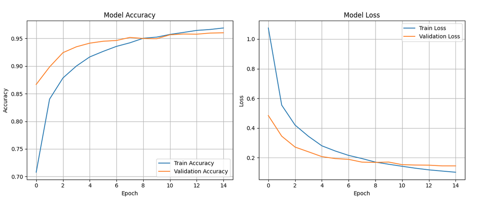
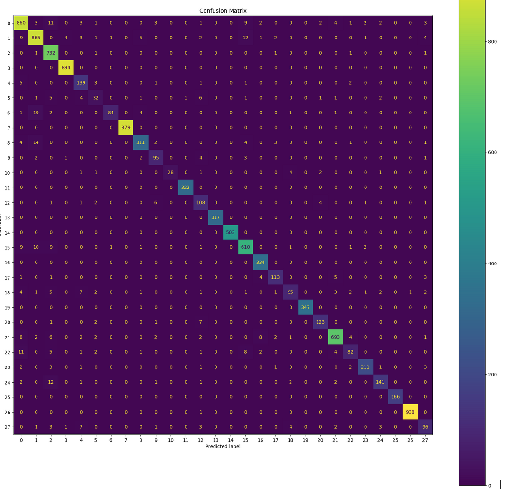

# Music Instrument Classification

Overview

This repository contains Python code for classifying musical instruments from audio files. The classification system processes audio files, extracts features, and applies machine learning models (CNN) to predict the instrument in the track. We use the Librosa library to handle audio analysis and feature extraction.

# 📌 Features

    Audio preprocessing and MFCC feature extraction using Librosa
  
    Data serialization to JSON
  
    A CNN model for multi-class classification
  
    Model training and evaluation
  
    Metrics: Precision, Recall, F1 Score
  
    Confusion Matrix visualization

# 🎼 Dataset
    Data was downloaded from this Kaggle dataset: https://www.kaggle.com/datasets/abdulvahap/music-instrunment-sounds-for-classification
    The music_dataset folder contains subfolders named after instrument classes.

    Each subfolder will have .wav files.

    Example:
    music_dataset/
    ├── piano/
    │   ├── 1.wav
    │   ├── 2.wav
    ├── Accordian/
    │   ├── 47.wav
    │   ├── 48.wav
    ...
# 🧪 Data Preparation

    Run this to extract MFCCs from audio files and serialize into a JSON file: "Music Instrument Classification_data prep.py"
# 🧠 Model Training

    Run this to train and evaluate the CNN model: Music Instrument Classification_CNN.py
    You’ll see plots for training vs validation accuracy/loss w.r.t Epoch, and a confusion matrix at the end. Note: Uding evaluation we tested upto 30 Epochs and found that there is no sigificant improvement in accuracy after 15 Epoch. Hence the plot is shown only upto 15 poch.

# 📊 Evaluation Metrics

    After training, the following metrics are printed:
    
        Precision
    
        Recall
    
        F1 Score

    A confusion matrix will be displayed to show per-instrument classification performance.

# 📈 Results

    Here’s what you can expect in output:
      Precision: 0.9275
      Recall: 0.9027
      F1 Score: 0.9129
    These scores indicate a strong and promising model with well-tuned hyperparameters.
    The confusion matrix confirms high accuracy in predicting most instrument classes.  

